# System Design - Foundation Materials

## Network Protocols

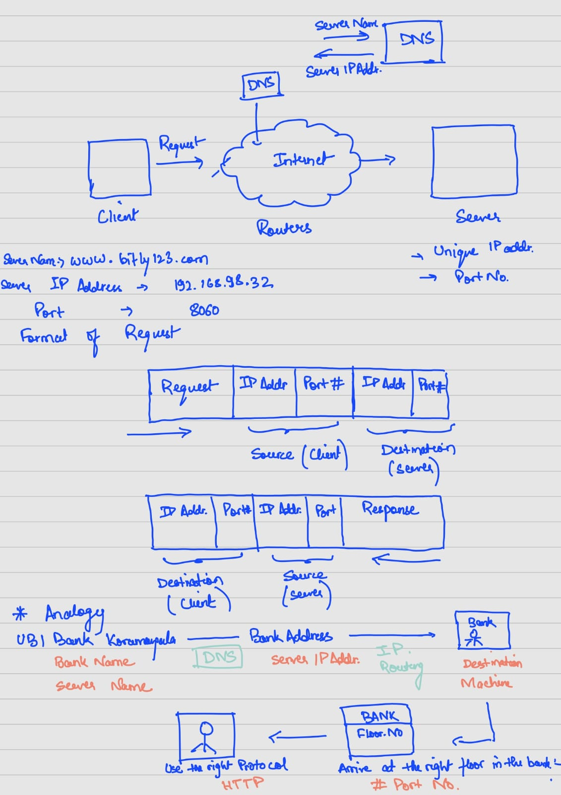

1. **Domain Name System [DNS]** - Service that takes in the human readable server name and returns the IP address of the destination server.

2. **Router** - Routes the request from the client server to the destination server.
3. **Port** -Identifies the specific endpoint in a server. Destination address is a combination of Server IP Address + Port Number
4. **Protocol** - Formal description of message format.Rules to be followed during the exchange.One of the famous protocol is TCP/IP.
5. **HTTP** - Protocol/Format of the request adhered by the client when sending the request to the server or from server back to the clinet.Used by the client browser to get back web pages from web servers. 
6. **HTML**- Format of the webpage text.

_**Curl Request - Response**_ 

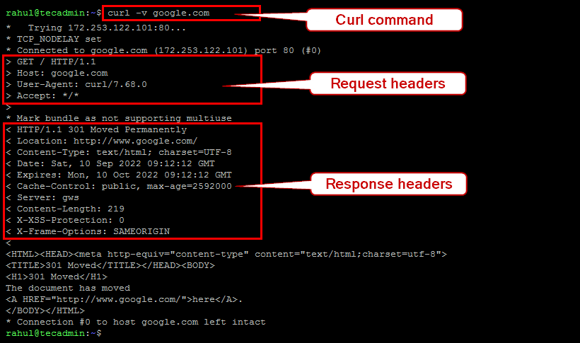

## Web Server
Web Server - Provides the framework to enable an online service.

Everything outside the brown box [Actual Processing logic] can be handled by the web server.

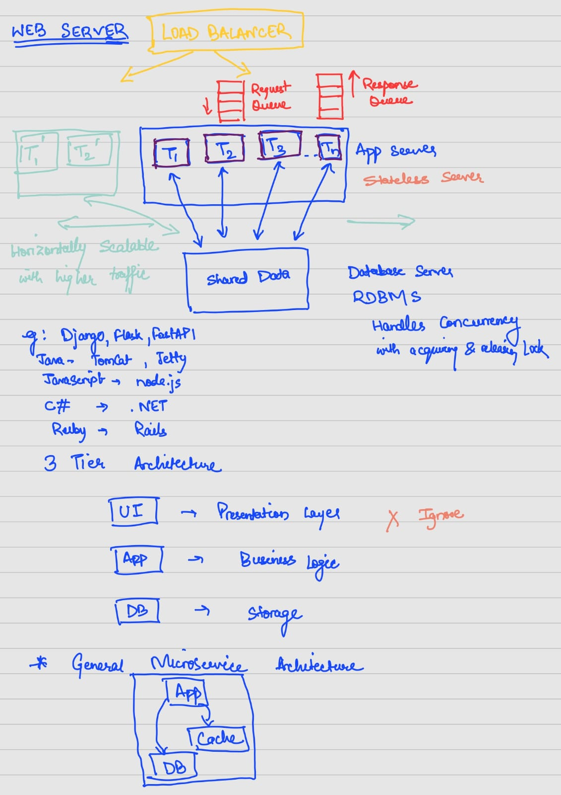

1. Parallelism - Use multiple copies of the running program (on multiple processors).

2. Multi-processing - Use multiple copies of the running program with independent resources.

3. Multi Threading - Even with a server containing only single processor ,we might want to process multipe requests as Disk /Network I/O operations takes a long time ,while one copy of request is blocked waiting for I/O,the processor can serve other requests.

In multi threading [avoiding blocking an request processing due to I/O operation], we need to ensure threads (all the copies of the running program) should have access to a single shared resource.

## Scaling
Reasons to go for distributed systems:

1. Check how much data needs to be stored : may need to scale DB and cache tier if size of the data is too huge.
2. If the number of requests per second is too huge , need to scale for throughput.
3. If the response time is too high , need to parallelize the computation.
4. Availability/Reliability in the face of faults.
5. Geolocation - Minimize network latency by multiple servers at different locations.
6. Hotspots - Disproportionately high load on a piece of data.

### Vertical Scaling / Scaled up/ Shared Memory Architecture

Going for a more powerful machine with many disks,many RAM chips and many CPUs

1. Cost eventually grows faster than linearly.
2. Has a ceiling 

### Horizontal Scaling / Scaling out / Shared nothing Architecture

Using large number of commodity machines and getting them to work together connected via network to provide the overall functionality.

## Performance Metrics for a Scalable System

Defining SLIs (Servive Level Indicators):
A quantitative measure of the level of service being provided.

1. **Correctness** - Is the right answer/data bbeing returned?. Error rate as a fraction of all requests.
2. **Availability** - Could we respond to the request? Fraction of time that a service is usable. Fraction of well-formed requests that succeeds.
	99% = 2nines , 99.999% = 5 nines , 3 1/2 nines = 99.95
	
3. **System Throughput** - The no, of requests/sec that could be handled by a server.
4. **Response Time** - How long it took to return a response to the client request.Anything below 300ms is widely accepted.**Round trip time[RTT]** is a part of response time and could be impacted by Geolocation.

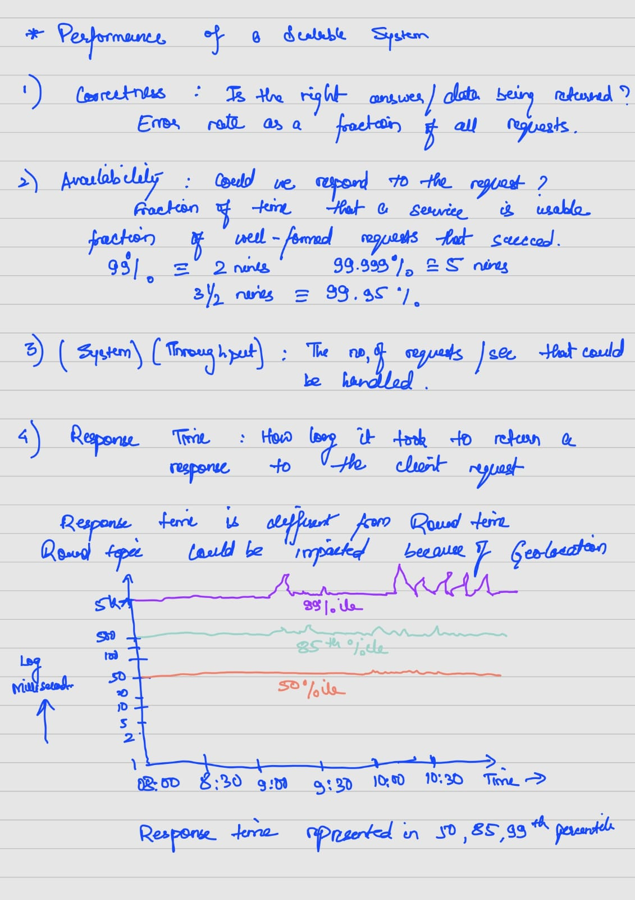

### Latency vs Response Time

Response Time = Latency(2 way Round Trip Time) + Service Time(at Server)

Latency - Duration that a request is "latent"(awaiting service), not being actually served.
Here, latency is a measure of network performance.

#### Other measures of Network Performance

1. Bandwidth [Data Rate]- No of bits that can be transmitted  over the network per second.It is the best available performance. The actual performance is measured through throughput.

	Assuming 10Mbps = 10 million bits/s
	For 1 bit = 1/ (10^7) = 0.1 \mus

2. Transmission time - Size of the message / Bandwidth
3. Propogation Delay - Distance / Speed of Light  
	Speed of Light Vaccum- 3 x 10^8 m/s   
	Speed of Light Optical Fibre - 2 x 10^8 m/s

4. Queueing Delay 
	
Total delay of the packet - Transmission Time + Propogation Delay + Queueing Delay

How large can a propogation delay could be?
Circumference of the earth ~ 40,000 km  
Speed of light in optical fibre - 2x10^8 m/sec  
Propogation time one way = 40,000 x 10^3 m/ 2 x 10^8 m/s = 0.2 sec ~ 200 ms

Also , the actual path will not be a straight line, there will be multiple routers en route and will also include queueing time. So , propogation time [one way] would be higher than 200 ms.

_Scenario -1_  
So for a lighter request packet with server service time being 10 ms, a user closer to the server would recieve faster response as compared to user who is far away on the other side of the earth. 
Response time is dominated by the propogation delay.

_Scenario-2_  
But if we consider a request packet of 25 MB,  
Given,Bandwith = 10 Mbps  
Transmission Time  = 25 x 10 ^6 x 8  / 10 x 10^6 = 20 sec  

Here, increasing the bandwidth , will reduce the transmission time. 
Response time is dominated by the transmission time.

## Reverse and Forward Proxy
A proxy is an intermediary between the client and server.
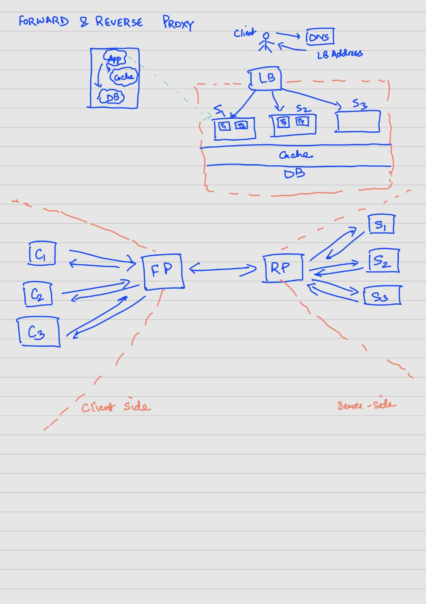

### Reverse Proxy
1. It is the server side proxy
2. Load Balancer could act as a reverse proxy
3. Handles decryption of incoming request and encryption of outgoing response.
4. Equipped with increased securtiy features as outside world interacts with reverse proxy as the application servers are not visible to the outside world.

### Forward Proxy
1. It is the client side proxy.
2. Act as a web cache , where if one client tries to access webpage already accessed before,could retrieve it from the cache ,rather than sending the request again.
3. Content Filtering -Prevents unauthorised access to unsafe webpages.

## Scaling the Stateless System using Replication- App Tier
## Load Balancing 
Load Balancer could be hardware based or software based.For our discussion we will only consider software load balancer.

Load Balancer work is minimal as compared to individual application servers and hence a single load balancer can handle 100s to 1000s of application servers.

Guesstimate - A load balancer handles 100k - 1M qps

Usage of Load Balancer 

1. Increase Throughput
2. Increase Availability - No single point of failure.
3. Reduces Response time [IP Anycast]

Policy for Sending Request to servers:

1. Round Robin or Random
2. Least number of active connections or Least response time or a combination of both with some weightage.
3. Hashing

DNS based Load Balancing - 
Allows load balancing across different load balancers within or across data centres.
DNS has a list of Load Balancer IP addresses mapped to a incoming single server address.So using the above policies we can make a call to one or more load balancers.

Different Setup Design for Load Balancer

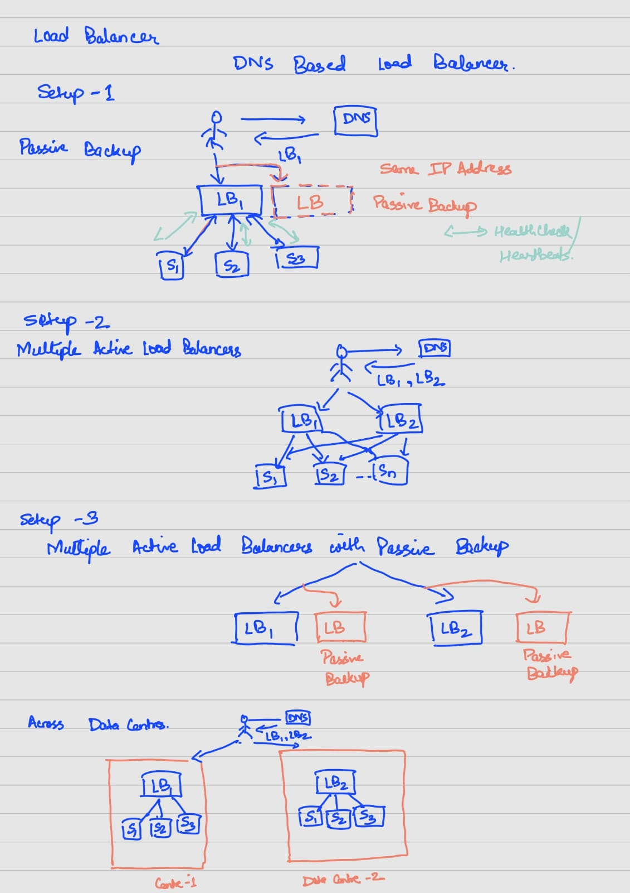

1. Load balancer with a passive backup load balancer. Two different hardware machines sharing the same IP address to handle availbility.
2. Multiple Active Load Balancers with independent IP addresses to handle throughput.
3. Multiple Active load Balancers with Passive Backup Load Balancers to handle both increased throughput and increased availability.
4. Global Load Balancing -Same setup can be spanned across Data Centres where in case of failure of one Data Centre servers, traffic gets handled by other Data Centre servers.

## IP Anycasting

Approach to Global Load Balancing with objective to reduce the response time.

To apply this approach, the company should own the data centres,routers and links on the internet. 

Different Data Centre Servers across different geographical location are given the same IP address. Router directs the traffic to the next hop link whcih lies in the closest path to reach the destination data server.
Each router knows the Closest data centre by running the Dijkstra's algorithm using the neighbour information broadcasted by its neighbouring routers. 

In case of outage in one of the data centres,routers re-routes the traffic to the next closest data centres via privately owned links.

  
## Scaling the Stateful System - Cache and DB Tier

### DB Tier

#### CRUD System

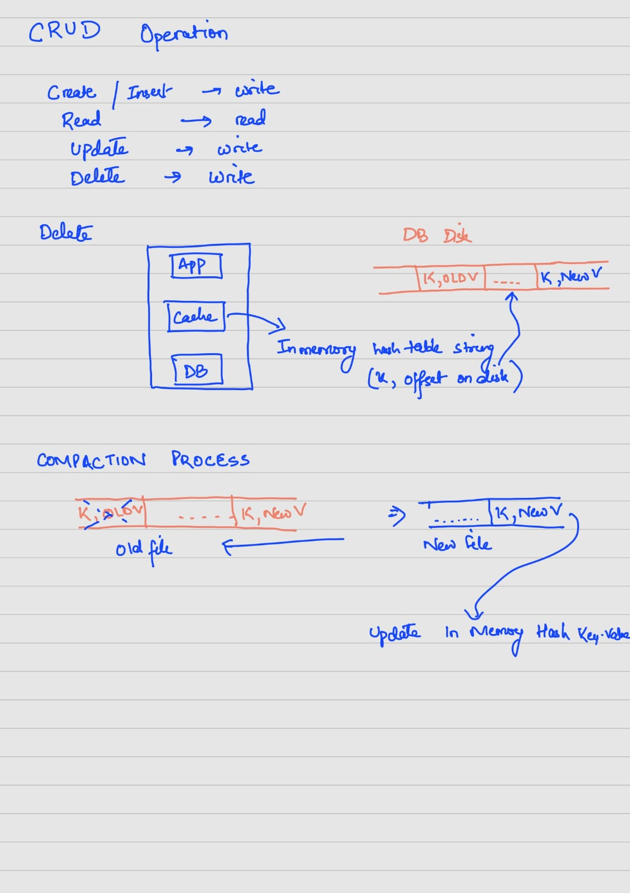

System which supports Create, Read, Update and Delete Operation.

In stateful systems, data replication[Cache and DB Tier] is much more difficult than the compute replication [App Tier] due to the CRUD operations.

We will go over scaling the Stateful System in two phases:

1. Stage-1 - Assuming data is small and fits into one server , will focus on availability, throughput, response time.
2. Stage-2 - Data is huge and needs multiple servers to store 

#### Stage -1 -  Availability , Throughput , Response time. - Read Heavy System

Things to Note:

1. Data fits into one server.
2. Read Heavy System
3. Build system focussing on availability , throughput , response time.

Setup

We have an App , Cache[in memory hash table] and DB Tier in a  Microservice where Cache holds the key and the value [offset on disk].

**Delete Operation**

Delete the key from the in memeory hash table , this will make the disk data inaccessible i.e defunct data.

**Update Operation**

1. Data in the disk is sequentially laid out back to back making no room for newer addition in between unless shifting all the values that would be costly.
2. We cannot directly update the value as the amount of updated text corresponding to the value might increase making the number of bytes for storing the text more than it was earlier. 
3. We will do Delete and then fresh insert operation to accomplish Update Operation.
	1. On disk - We will append a new key-value pair at the end of the file.
	2. On im memory hash table - Update the offset value to the most updated version of key value pair in the disk.
	3. Run the compaction process ,to clean up the older key-value pair.

**Compaction Process**
Read the disk file from the most recetly added end going backwards in time, and for every new key the compaction process sees ,it knows it is the latest value in file and copy the key value pair to a new location on disk where a new file is sequentially built up. New file is built up without any older data i.e defunct data Once this process is completed, the DB table switches to this new file.

#### Single Leader Data Replication

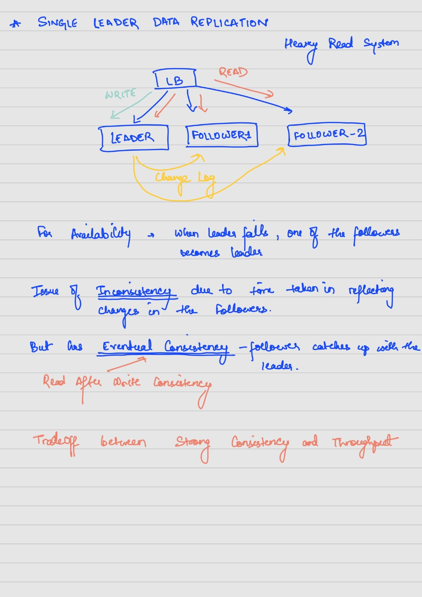

1. All writes goes into the leader / master / primary.
2. Leader records the change in the data and send the logs of changes i.e replication log to all the replicas.
3. Each follower, applies to same changes to its data as shared in the replication logs.
2. All Reads can be sent to any of the replicas.

Limitations

1. Inconsistency - Reads may sometimes see stale data until replication has completed.Eventually , the follower catches up with the leader i.e **Eventual Consistency** with some replication lag.
2. In scenario where leader is in one data centre and the follower in the other data centre, any write request on the other data centre where no leader is available ,response time for write operation would be higher.

**Strong Consistency**

When client can't tell that the system is replicated.

One way to achieve strong consistency in the Single Leader Data Replication is by putting a lock on read operation untill all the write operation is replicated across leader and followers.However it would impact the throughput of the system.

There is a tradeoff between Strong Consistency and Higher troughput in the Single Leader Data Replication setting.

#### MultiLeader Data Replication
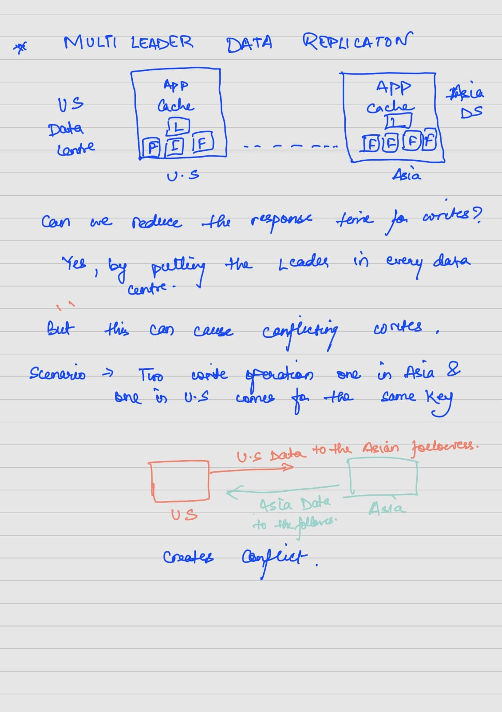

Single Leader Replication could handle the throughput and availability issues but didnot do well in response time.

In Multi Leader setting ,put one leader in each data centre,so that the response time for write operation goes down. However time taken for Eventual Consistency would remain the same as the change logs has to be sent to the other data centre.

Issues

1. How to handle two simultaneous write operation on the same key in two different data centres.

Use most latest timestamp of the request to resolve the conflict.
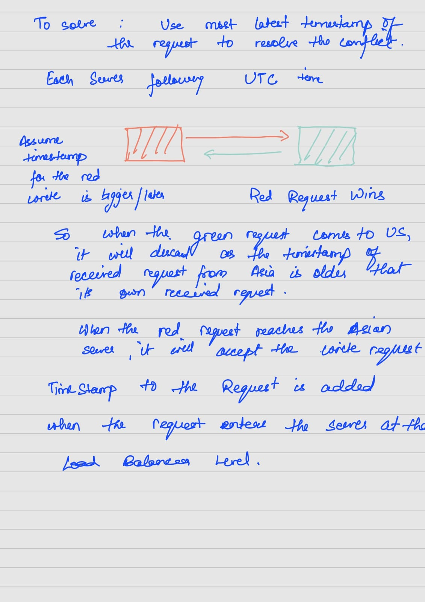

#### Leaderless Replication with Quorum Reads and Writes 

Instead of leader being the source of truth , a simple majority of replicas can be the source of truth.

Steps:
1. When writing , send the request to all the replicas.
2. Once majority of them ack the write ,consider it successful.
3. When reading , ask for everyone's opinion and take the majority views.(assuming every replica responds)	.
4. In case of tie , timestamp can help us discern the truth.

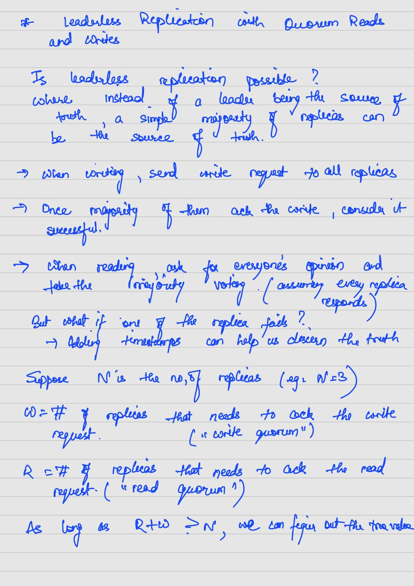

N - Total number of replicas.
Write Quorum [W]- No of replicas that needs to ack the write request.

Read Quorum [R]- No of replicas that needs to ack the read request.

Neccessary Condition  - W + R > N 

Choosing value of R and W can be prioritised based on the requirements whether read needs to be faster or writ needs to be faster, but ensure R and W is not equal to N as then in case of failure of any replica, read or write operation will fail.

Eventual Consistency is achieved using this approach.

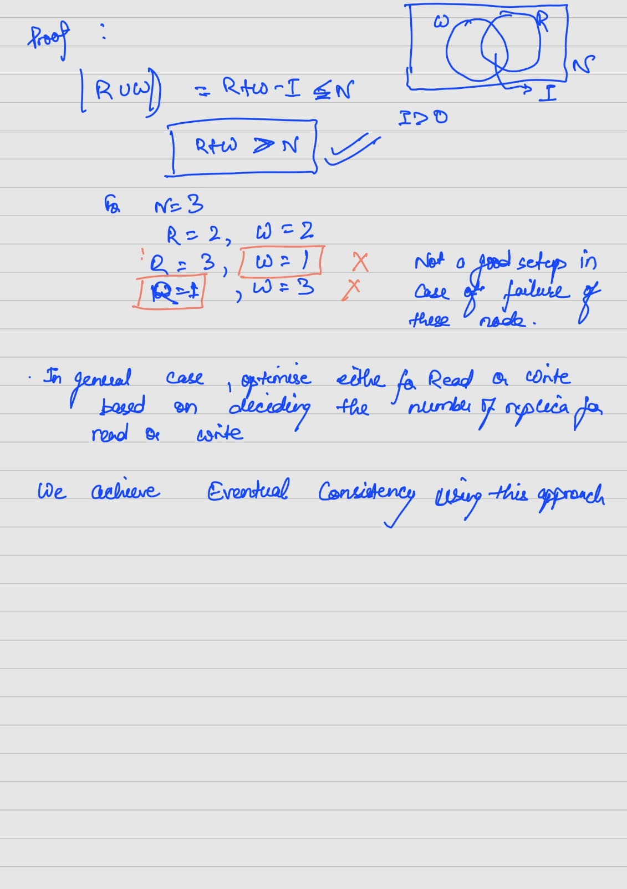

#### CAP Theorem 
C- Consistent
A- Available
P - Partition

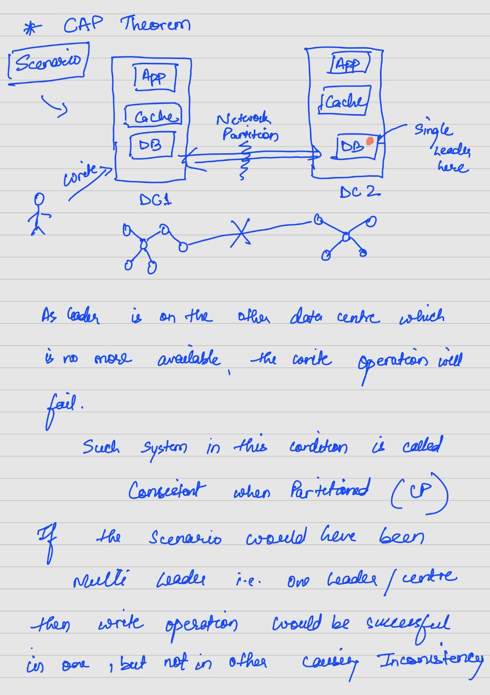
Applicable for a specific kind of failure which is the network partition across two different data centres.

For a single leader replication scenario , when network partition happens, the write request on the data centre where there is no leader will be rejected as the request cannot reach the leader. 

Hence , it impacts the availability of the system, but the system is consistent. Such systems are called Consistent when Partitioned systems. [CP]

For a multi leader replication scenario, when network partition happens, the write request will be successful , but the write logs will not be replicated across different data centre due to network partition,

Hence , it impacts the consistency of the system, but the system is available. Such systems are called Available when Partitioned systems. [AP]

**CAP Theorem** 
When network partitioned ,a distributed system can be either AP or CP but not both CA.

A system which is CA is not a distributed system.

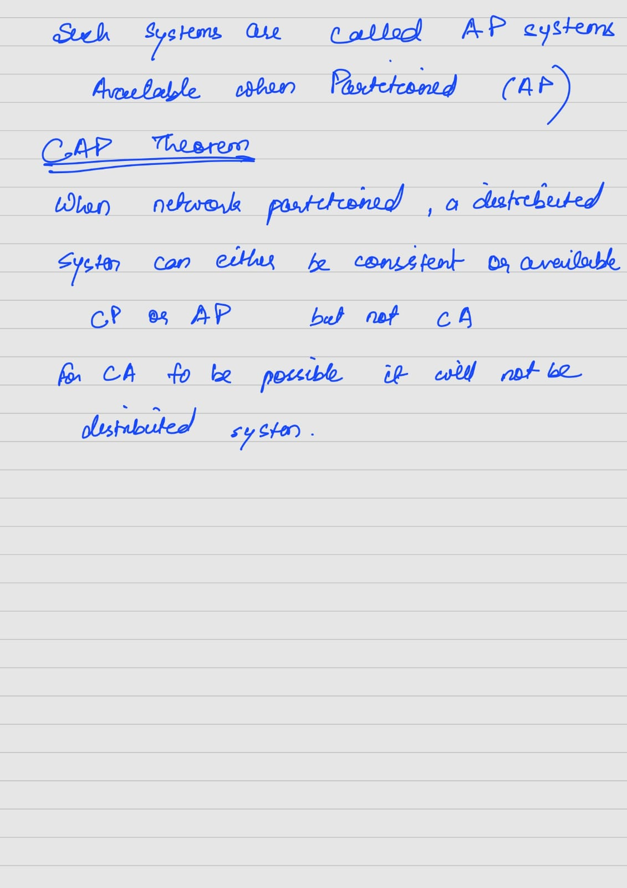

#### Content Distribution Network

Instead of setting up a microservice containing App, Cache and DB tier , just create a microservice with App and Cache tier which are called Proxy server caches for faster retrieval of popular data.
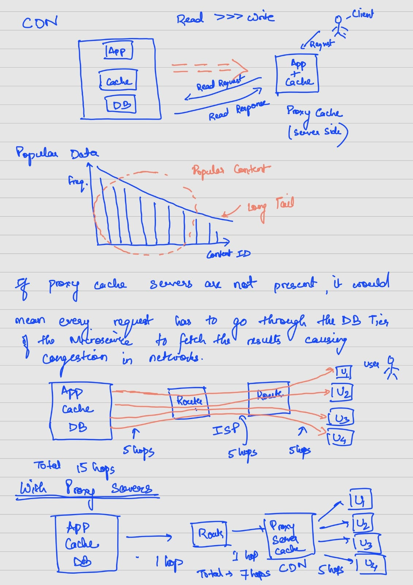

CDN - Geographically distributed collection of proxy servers caches which stores not all but most of the popular content close to the end users for faster response time.
They are good for static data storage.

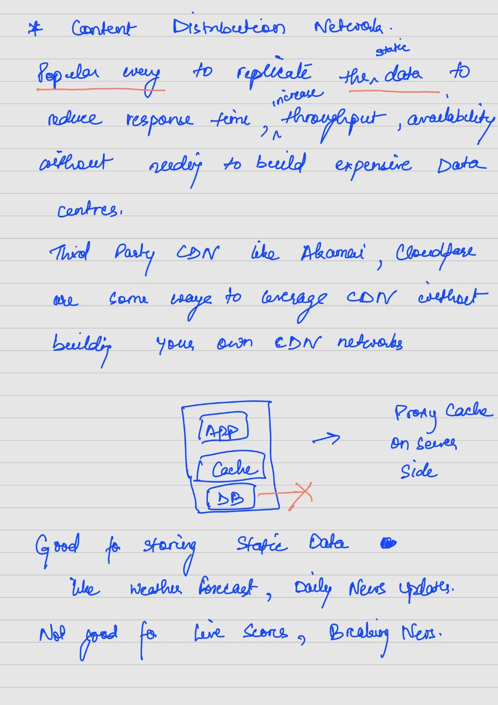

### Cache Tier

Primary Purpose of the Cache Tier is to increase throughput of the system.

#### Cache CRUD Operation

Read Operation with and without Cache Miss

1. GET operation on Cache
2. If found return from Cache
3. Else , if not found, GET operation on DB [Cache Miss]
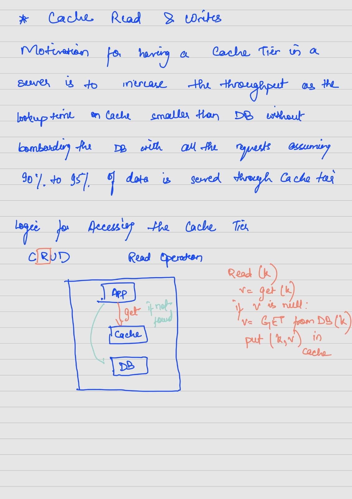

Write Operations

1. Insert New key-value
	1. Insert in DB
	2. Put in Cache
2. Update key-value 
	1. Delete from Cache
	2. Insert in DB
	3. Put in Cache
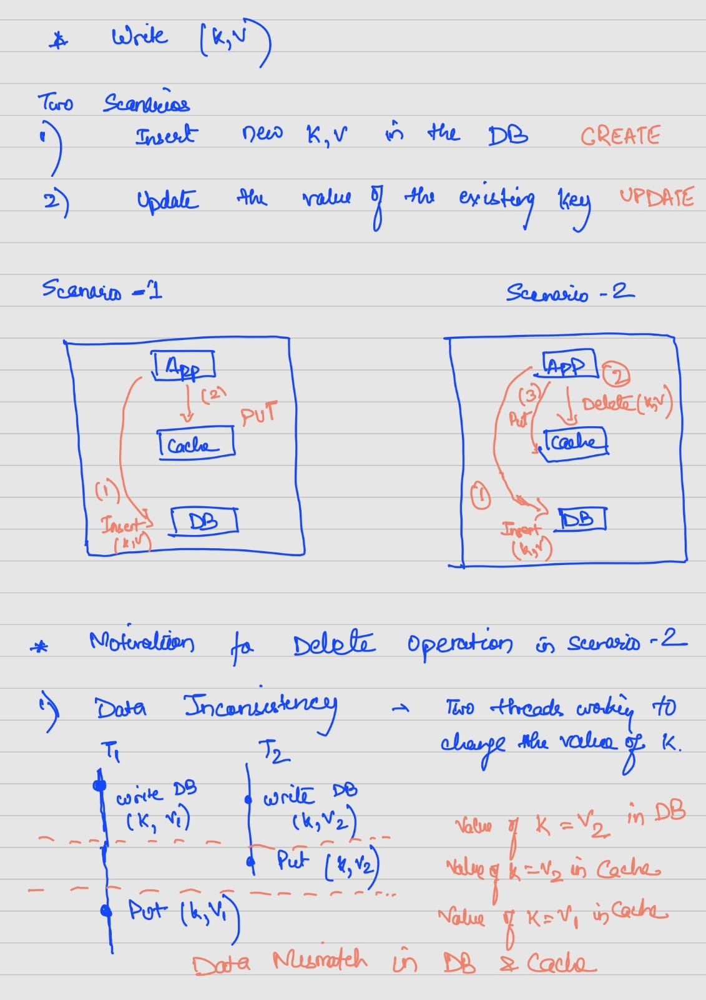

3. Delete  key-value
	1. Delete from DB
	2. Delete from Cache
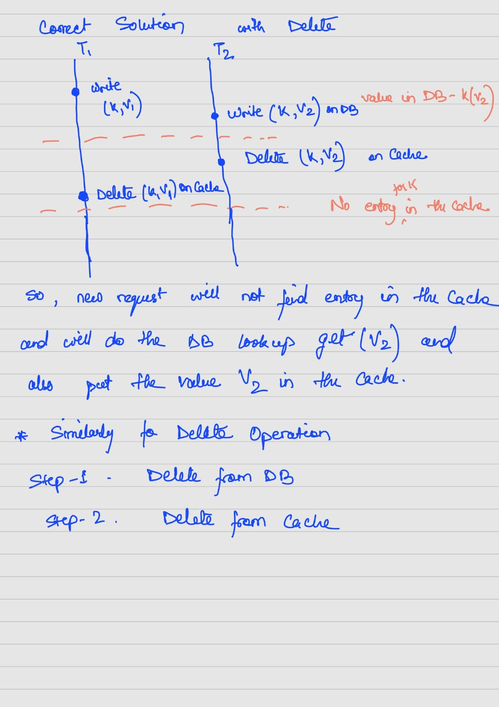

### Cache Tier Strategies

1. Cache Aside Approach
	1. App tier interacts with both Cache Tier and DB Tier.
	2. DB Tier and Cache Tier donot interact with each other.

Replication in Cache Aside Scenario could be done through Leader Based Replication or Leaderless Replication using Quoram Read and Writes.

Consistency in Cache Replicas is not of a very big concern as our souce of truth is the DB Tier. So untill all the replicas has the popular key-value pair ,which accounts for 98 to 99% of read served , we are good.

2. Read Through Strategy
	1. App Tier only interacts with Cache Tier.
	2. Cache Tier interacts with DB Tier.

Read Operation in Read Through Strategy

1. Read request from App Tier to Cache Tier.
2. If found, return from Cache.
3. Else, Cache sends GET request to DB.
4. DB returns to Cache.
5. Cache returns to App.

Write Operation in Read Through Strategy

1. Write request from App Tier to Cache Tier.
2. Cache inserts the key-value pair
3. Write Request from Cache to DB.
4. DB writes and returns Success.
5. Cache sends the success back to get the next write request.

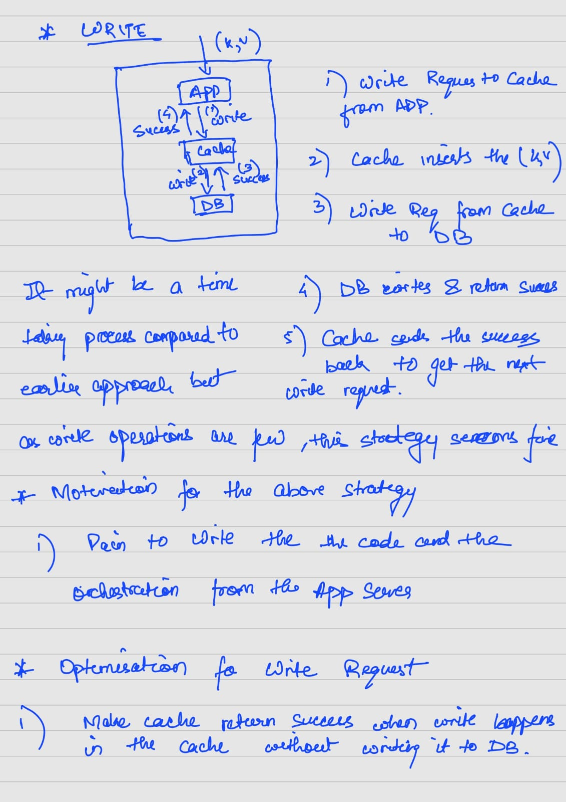

Advantage of Read Through Strategy

1. No need to write and manage the code and the orchestration from the app server.

Limitation of Read Through Strategy
Read Through Strategy when compared to Cache Aside Approach takes longer for the write operation,however as the number of writes are few, both approaches are practical.

We can optimise the Write Operation in the Read Through Strategy using the  
**Write Back or Write Behind Strategy** which works as follows:

1. Make cache return success when write happens in the cache without writing it to the DB.
2. In such cases, the cache can sent the write request to DB in two ways:
	1. As a batch job, when good amount of data is there to be pushed to DB.
	2. Write when the cache is full following the LRU policy also called lazy writing.

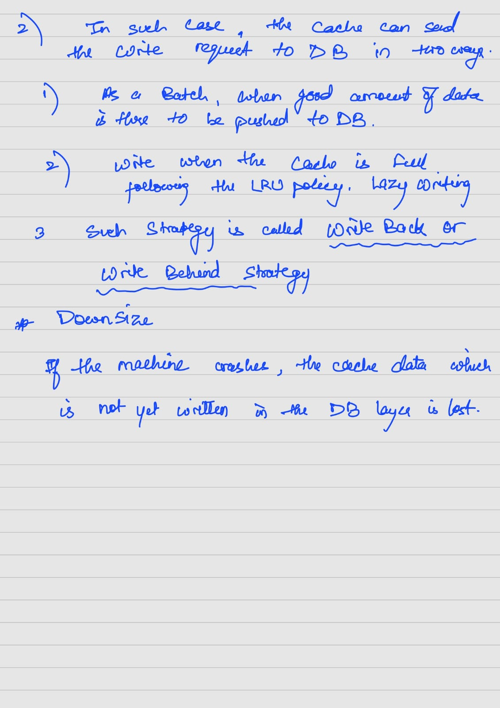
Limitation of Write Back or Write Behind Strategy

1. If the machine crashes, the cache data which is not yet written in the DB layer is lost.

#### Stage -2 -  Scaling for Data - Write Heavy System

Up untill now , we have looked into understanding the Load Balancer, Replication and Caching Strategies considering a Read heavy(R>>>W) system assuming a single database server can hold all the data.

But now, we will make the situation more complex by  adding the fact that:

1. Our data doesnot fit into one server.We need multiple servers to distribute and store data.
2. Write queries per second is so high, that a single machine couldn't handle.

#### Sharding

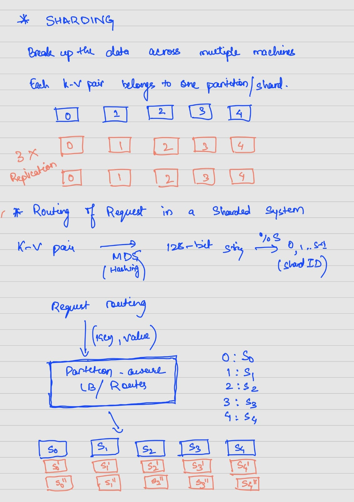
Instead of all data (k-v pair) residing in one data server ,it is partitioned across different data servers, where each k-v pair belong to one partition/shard.

Assumption we are taking here is each partition/shard make up a separate DB/cache.

To improve availability, we apply the replication factor to be 3, and we can use any of the above Replication strategies.

**Hotspot**

When a partition is so skewed that it gets disproportionate amount of query, we call it a hotspot.

Our goal of partitioning should we such that:

1. Spread the data evenly across shards.
2. Query load to be distributed equally across shards.

Doing so, we ensure none of the partition/shard becomes a candidate of a hotspot.

Let's look at the Routing strategy which works for the sharded DB Tier avoiding hotspot:

1. Load Balancers/Routers that routes the request are called Partiton Aware Load Balancer/Router.

2. We rely on the hashing techinque(unpredictable yet deterministic) to identify the shard to route the traffic.

3. For availability , we can think of each shard having a 3x replication.

#### Resharding 

Reasons for Resharding

1. Data size/write queries is unexpectedly increasing with time.
2. start small,want to scale in future when data grows beyond one server capacity.

One approach to do that would be add one more server.But that would change the shard id numbers and hence all the data and queries needs to be moved from one shard server to another i.e Rebalancing/Resharding which is very expensive ~O(n) if k is the number of key-value pairs that needs to be moved from  one shard server to another and we will have many such shard servers.

#### Consistent Hashing

Instead of partitioning the data based on number of servers, we partition both data and servers using a virtual partition/shard id is called Consistent Hashing. 

Consider k number of key-value pairs(i1,i2,i3...ik) and n number of shard servers(j1,j2..jn-1) and b is the number of virtual partitions/shards we desire.

Note - Here Shard Servers is different from the partitions/shards , as one shard server can contain multiple partitions/shards.

1. Identify which key value pair goes in which partition/shard, by finding key-value hash using b.
So,the key-value hash ids for kth key-value pair = MD5(ik) %b.
2. Identify the shard server in which a particular partition/shard lies by finding which server_id hash using b.So,the server_id hash for n-1th server = MD5(j(n-1))%b.

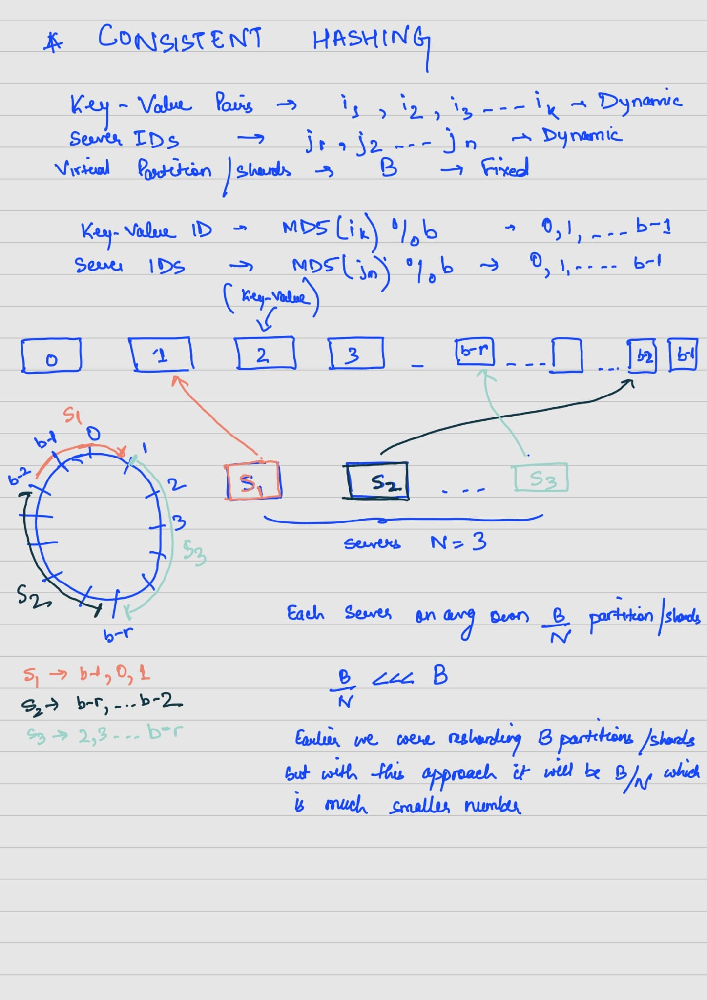

**Addition and Failure of Servers**
 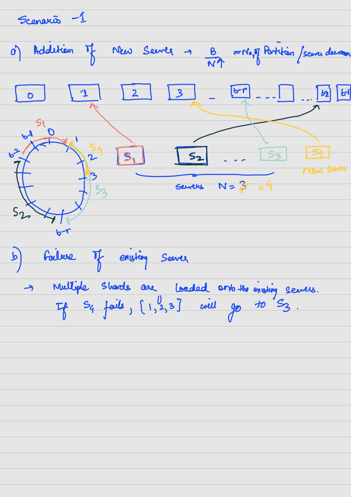
 
 
**Consistent Hashing with Replication**
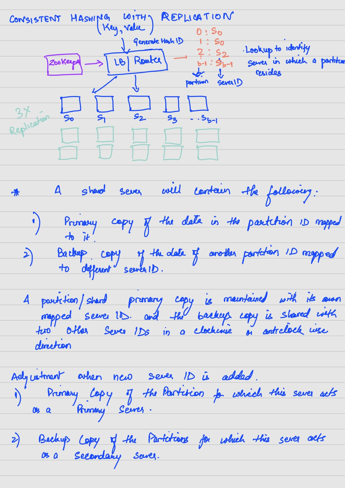

 

